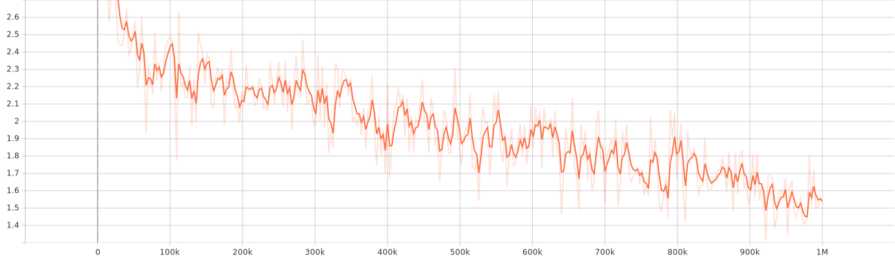

# ALBERT-Mongolian
This repo provides pretrained ALBERT model ("A Lite" version of BERT) and SentencePiece model (unsupervised text tokenizer and detokenizer) train in Mongolian text corpus, which is provided by [Mongolian BERT repository](https://github.com/tugstugi/mongolian-bert).

## Pretrained models
[Pretrained BERT model and trained SentencePiece model](https://huggingface.co/bayartsogt/albert-mongolian)

Here is pretraining loss:


### Transformers usage
Now you can use Pretrained ALBERT Mongolian in [Transformers](https://github.com/huggingface/transformers)
```python
import torch
from transformers import AlbertTokenizer, AlbertForMaskedLM

tokenizer = AlbertTokenizer.from_pretrained('bayartsogt/albert-mongolian')
model = AlbertForMaskedLM.from_pretrained('bayartsogt/albert-mongolian')
```

### Experiment with ALBERT-Mongolian

Simple tutorial of ALBERT-Mongolian is recorded in *AWS-Mongolians e-meetup #3*. 
You can follow up using links below:
* notebook: [ALBERT_Mongolian_MLM.ipynb](https://github.com/bayartsogt-ya/ml-tutorials/blob/master/ALBERT_Mongolian_MLM.ipynb)
* video tutorial:

<a href="http://www.youtube.com/watch?feature=player_embedded&v=m-iVftIlRyU&t=6215s
" target="_parent"></a>

## Results

You can easily *fine-tune* ALBERT-Mongolian using [Official repo of ALBERT](https://github.com/google-research/albert).

The model also evaluated on a simple Mongolian text classification problem with [Eduge dataset](https://github.com/tugstugi/mongolian-nlp/blob/master/datasets/eduge.csv.gz).

While ALBERT-base is compatible in terms of results shown below, it is over 10 times (only 135MB) smaller than BERT-base (1.2GB).

(Please notice that we using different test set here)
* ALBERT-Mongolian:
```
                          precision    recall  f1-score   support

            байгал орчин       0.83      0.76      0.80       483
               боловсрол       0.79      0.75      0.77       420
                   спорт       0.98      0.96      0.97      1391
               технологи       0.85      0.83      0.84       543
                 улс төр       0.88      0.87      0.87      1336
              урлаг соёл       0.89      0.94      0.91       726
                   хууль       0.87      0.83      0.85       840
             эдийн засаг       0.80      0.84      0.82      1265
              эрүүл мэнд       0.84      0.90      0.87       562

                accuracy                           0.87      7566
               macro avg       0.86      0.85      0.86      7566
            weighted avg       0.87      0.87      0.87      7566
```

* BERT-Mongolian: from [Mongolian Text Classification](https://github.com/sharavsambuu/mongolian-text-classification)
```
                          precision    recall  f1-score   support

            байгал орчин       0.82      0.84      0.83       999
               боловсрол       0.91      0.70      0.79       873
                   спорт       0.97      0.98      0.97      2736
               технологи       0.91      0.85      0.88      1102
                 улс төр       0.87      0.86      0.86      2647
              урлаг соёл       0.88      0.96      0.92      1457
                   хууль       0.86      0.85      0.86      1651
             эдийн засаг       0.84      0.87      0.85      2509
              эрүүл мэнд       0.90      0.90      0.90      1159

                accuracy                           0.88     15133
               macro avg       0.88      0.87      0.87     15133
            weighted avg       0.88      0.88      0.88     15133
```

## Pretrain from Scratch

### Install Required packages
```
git clone --recurse-submodules https://github.com/bayartsogt-ya/albert-mongolian.git
pip install -r requirement.txt
```

### Download data
This section is done by [tugstugi/mongolian-bert#data-preparation](https://github.com/tugstugi/mongolian-bert#data-preparation)
```bash
python3 datasets/dl_and_preprop_mn_wiki.py         # Mongolian Wikipedia
python3 datasets/dl_and_preprop_mn_news.py         # 700 million words Mongolian news data set
cat mn_corpus/*.txt > all.txt                      # Put them all to one file
```

### Train SentencePiece model
First you need to [install sentencepiece from source](https://github.com/google/sentencepiece#c-from-source)
Then start training (which requires ~30GB memory)

if you are training uncased model, you need to lowercase the input data.
```bash
python do_lowercase.py --input ./all.txt --output ./all_lowercased.txt
# train_spm_model.sh [INPUT_FILE_PATH] [SP_MODEL_PATH]
train_spm_model.sh ./all.txt 30k-mn-uncased
```

Otherwise, just run:
```
train_spm_model.sh ./all.txt 30k-mn-cased
```

### Build tf records for pretraining
Now you can use `mn_corpus/*.txt` to produce `*tf_record` files. Here the first parameter is path to `*.txt` files and second one for max sequence length.
```bash
# source build_pretraining_data.sh [BASE_DIR] [MAX_SEQ_LEN] [SP_MODEL_PREFIX]
source build_pretraining_data.sh ./mn_corpus 512 30k-mn-cased
```

After the above command produces `*.tf_record` files, you should upload them to Google Cloud Storage (GCS).
```source
gsutil -m cp ./mn_corpus/*.tf_record gs://YOU_BUCKET/folder/
```

### Start Pretraining
```bash
python -m albert.run_pretraining \
    --input_file=... \
    --output_dir=... \
    --init_checkpoint=... \
    --albert_config_file=... \
    --do_train \
    --do_eval \
    --train_batch_size=512 \
    --eval_batch_size=64 \
    --max_seq_length=512 \
    --max_predictions_per_seq=20 \
    --optimizer='lamb' \
    --learning_rate=.00176 \
    --num_train_steps=1000000 \
    --num_warmup_steps=3125 \
    --save_checkpoints_steps=10000 \
    --use_tpu=true \
    --tpu_name=your_tpu_name \
    --tpu_zone=your_tpu_zone \
    --num_tpu_cores=8
```

## Reference
1. [ALBERT - official repo](https://github.com/google-research/albert)
2. [WikiExtrator](https://github.com/attardi/wikiextractor)
3. [Mongolian BERT](https://github.com/tugstugi/mongolian-bert)
4. [ALBERT - Japanese](https://github.com/alinear-corp/albert-japanese)
5. [Mongolian Text Classification](https://github.com/sharavsambuu/mongolian-text-classification)
6. [You's paper](https://arxiv.org/abs/1904.00962)
7. [AWS-Mongolia e-meetup #3](https://www.youtube.com/watch?v=m-iVftIlRyU)

## Citation
```
@misc{albert-mongolian,
  author = {Bayartsogt Yadamsuren},
  title = {ALBERT Pretrained Model on Mongolian Datasets},
  year = {2020},
  publisher = {GitHub},
  journal = {GitHub repository},
  howpublished = {\url{https://github.com/bayartsogt-ya/albert-mongolian/}}
}
```
